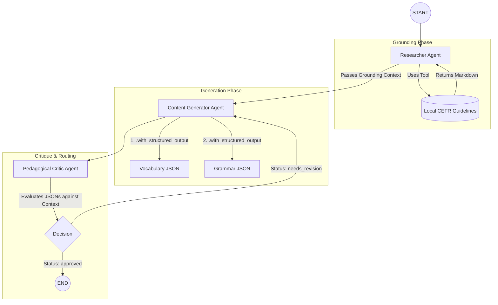

# Autonomous Curriculum Generator

Multi-agent pipeline (Python, **LangGraph**, **Google Gemini 2.5 Flash** via LangChain) that produces **strictly typed, CEFR-aligned** vocabulary and grammar curriculum JSONs for a given language and level. Grounded via local authoritative sources to eliminate LLM hallucinations.

## Architecture

The system utilizes a cyclic LangGraph workflow to ensure pedagogical accuracy and data validity before output generation.


    
### Components Overview

| Area | Role |
|------|------|
| `src/graph.py` | LangGraph `StateGraph`, cyclic critique loop |
| `src/agents.py` | `research_node`, `generate_node`, `critique_node` |
| `src/tools.py` | Deterministic grounding reads / chunking / retrieval |
| `src/schemas.py` | Strict Pydantic models for dual-JSON export and validation |
| `data/input/` | CEFR rules and reference markdown/text (`cefr_guidelines.md`) |
| `data/output/` | Generated curriculum JSONs |

## Setup & Execution

1. **Python**: Use Python 3.11+ (recommended).
2. **Virtual environment**:
   ```bash
   python -m venv .venv
   .\.venv\Scripts\activate   # Windows
   pip install -r requirements.txt
   ```
3. **Environment**: Copy `.env.example` to `.env` and set your `GOOGLE_API_KEY`. Ensure `GEMINI_MODEL="gemini-2.5-flash"` is set.
4. **Run**:
   ```bash
   python -m src.main --language Spanish --level A2
   ```

Output dynamically generates two separate, structurally validated files: `data/output/curriculum_<UTC timestamp>_vocabulary.json` and `..._grammar.json`.